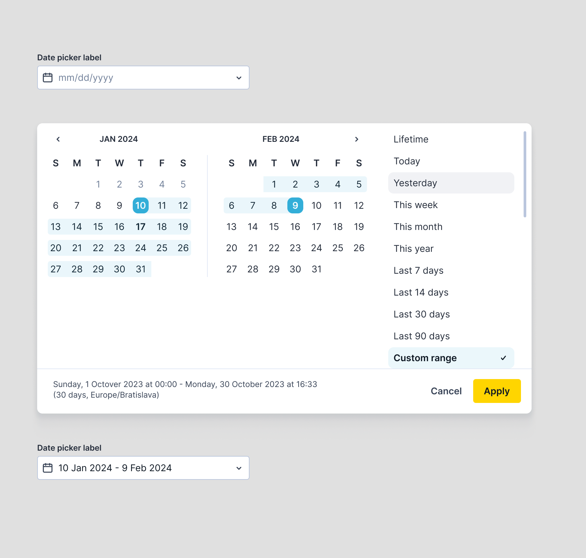

# Assignment

Your task is to build the date range picker shown in this Figma project.
Treat it as part of a design system, not a one-off screen.

## Tech stack

- Use Angular + CSS or SCSS. Do not use a UI library for the picker itself. You may use a small date utility library, but not a prebuilt date range picker package like `ngx-daterangepicker`.

## Scope

- A trigger element that opens the picker with proper positioning.
- A two-month calendar with date range selection.
- A presets sidebar with the options shown in the design (Lifetime, Today...). Selecting a preset option updates the calendar. A manual selection switches the preset to Custom range.
- A footer showing a summary of the selected range, along with Cancel and Apply buttons.
- Apply should emit the selected range, and also log it to the console for review purposes. Cancel reverts the selection. Both actions close the picker.
- No optimization is required for viewports below 1280px (mobile and iPad layouts are out of
  scope).

## Deliverables

- Send us a link to a GitHub repo with your solution.

## Time box

- Maximum 6 hours working time that you can split within 2 days. We want to see what you can complete within that timeframe.  
  You may leave comments explaining what you would have implemented with more time.
